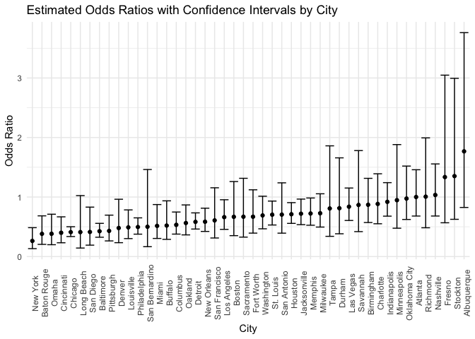
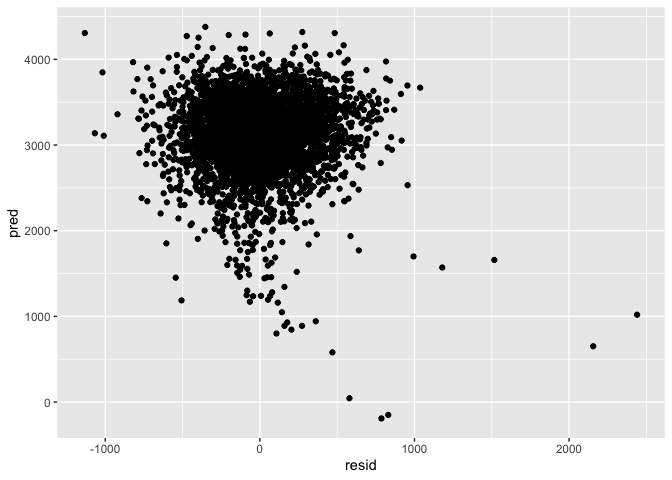
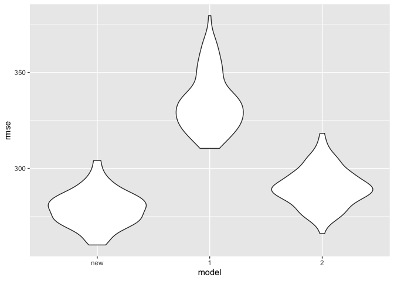

p8105_hw6_yz4990
================
Yucheng Zhao
2024-12-02

## Problem 1.

``` r
weather_df = 
  rnoaa::meteo_pull_monitors(
    c("USW00094728"),
    var = c("PRCP", "TMIN", "TMAX"), 
    date_min = "2017-01-01",
    date_max = "2017-12-31") %>%
  mutate(
    name = recode(id, USW00094728 = "CentralPark_NY"),
    tmin = tmin / 10,
    tmax = tmax / 10) %>%
  select(name, id, everything())
```

    ## using cached file: /Users/zhaoyudeng/Library/Caches/org.R-project.R/R/rnoaa/noaa_ghcnd/USW00094728.dly

    ## date created (size, mb): 2024-12-02 22:12:53.992044 (8.667)

    ## file min/max dates: 1869-01-01 / 2024-11-30

bootstrap, confidence intervals for $R^2$ and $log(\beta_{1}\beta_{2})$

``` r
log_ab = function(mod) {
  a = broom::tidy(mod)$estimate[1]
  b = broom::tidy(mod)$estimate[2]
  return(log(a * b))
}

boot = weather_df |> 
  modelr::bootstrap(n = 5000) |> 
  mutate(
    models = map(strap, \(df) lm(tmax ~ tmin, data = df) ),
    r2 = map_dbl(models, \(mod) broom::glance(mod)$r.squared),
    log_b1b2 = map_dbl(models, \(mod) log_ab(mod))
  ) |> 
  summarize(
    r2_lo = quantile(r2, 0.025),
    r2_up = quantile(r2, 0.975),
    log_b1b2_lo = quantile(log_b1b2, 0.025),
    log_b1b2_up = quantile(log_b1b2, 0.975)
  )

boot
```

    ## # A tibble: 1 × 4
    ##   r2_lo r2_up log_b1b2_lo log_b1b2_up
    ##   <dbl> <dbl>       <dbl>       <dbl>
    ## 1 0.894 0.927        1.96        2.06

## Problem 2.

data cleaning

``` r
homi_df = read_csv("./data/homicide-data.csv", 
                   na = c("NA", "Unknown", ""), 
                   ) |> 
  janitor::clean_names() |> 
  mutate(
    city_state = paste(city, state, sep = ", "),
    resolved = as.numeric(disposition == "Closed by arrest")
    ) |> 
  filter(city != "Dallas", 
         city != "Phoenix",
         city != "Kansas City", 
         city != "Tulsa") |> 
  filter(victim_race == "White" | victim_race == "Black") |> 
  drop_na(victim_age) |> 
  mutate(victim_age = as.numeric(victim_age))
```

    ## Rows: 52179 Columns: 12
    ## ── Column specification ────────────────────────────────────────────────────────
    ## Delimiter: ","
    ## chr (8): uid, victim_last, victim_first, victim_race, victim_sex, city, stat...
    ## dbl (4): reported_date, victim_age, lat, lon
    ## 
    ## ℹ Use `spec()` to retrieve the full column specification for this data.
    ## ℹ Specify the column types or set `show_col_types = FALSE` to quiet this message.

``` r
head(homi_df)
```

    ## # A tibble: 6 × 14
    ##   uid   reported_date victim_last victim_first victim_race victim_age victim_sex
    ##   <chr>         <dbl> <chr>       <chr>        <chr>            <dbl> <chr>     
    ## 1 Alb-…      20100601 SATTERFIELD VIVIANA      White               15 Female    
    ## 2 Alb-…      20100102 MULA        VIVIAN       White               72 Female    
    ## 3 Alb-…      20100126 BOOK        GERALDINE    White               91 Female    
    ## 4 Alb-…      20100130 MARTIN-LEY… GUSTAVO      White               56 Male      
    ## 5 Alb-…      20100308 GRAY        STEFANIA     White               43 Female    
    ## 6 Alb-…      20100323 DAVID       LARRY        White               52 Male      
    ## # ℹ 7 more variables: city <chr>, state <chr>, lat <dbl>, lon <dbl>,
    ## #   disposition <chr>, city_state <chr>, resolved <dbl>

logistic regression for binary variable “resolved”

``` r
balti_df = homi_df |> 
  filter(city == "Baltimore")

fit_logistic = 
  balti_df |> 
  glm(resolved ~ victim_age + victim_sex + victim_race, data = _, family = binomial()) 

fit_logistic |> 
  broom::tidy(conf.int = TRUE) |> 
  filter(term == "victim_sexMale") |> 
  mutate(OR = exp(estimate),
         conf.low = exp(conf.low), 
         conf.high = exp(conf.high)
         ) |>
  select(term, OR, conf.low, conf.high) |> 
  knitr::kable(digits = 3)
```

| term           |    OR | conf.low | conf.high |
|:---------------|------:|---------:|----------:|
| victim_sexMale | 0.426 |    0.324 |     0.558 |

glm for each city

``` r
results_df = homi_df |> 
  group_by(city) |> 
  nest() |> 
  mutate(
    model = purrr::map(data, \(x) glm(resolved ~ victim_age + victim_sex + victim_race, 
                                          data = x, family = binomial())),
    outputs = purrr::map(model, \(x) broom::tidy(x, conf.int = TRUE))
    ) |> 
  unnest(outputs) |> 
  filter(term == "victim_sexMale") |> 
  mutate(
    OR = exp(estimate),
    conf.low = exp(conf.low),
    conf.high = exp(conf.high)
    ) |>
  select(term, OR, conf.low, conf.high)
```

    ## Adding missing grouping variables: `city`

``` r
knitr::kable(results_df, digits = 3)
```

| city           | term           |    OR | conf.low | conf.high |
|:---------------|:---------------|------:|---------:|----------:|
| Albuquerque    | victim_sexMale | 1.767 |    0.825 |     3.762 |
| Atlanta        | victim_sexMale | 1.000 |    0.680 |     1.458 |
| Baltimore      | victim_sexMale | 0.426 |    0.324 |     0.558 |
| Baton Rouge    | victim_sexMale | 0.381 |    0.204 |     0.684 |
| Birmingham     | victim_sexMale | 0.870 |    0.571 |     1.314 |
| Boston         | victim_sexMale | 0.667 |    0.351 |     1.260 |
| Buffalo        | victim_sexMale | 0.521 |    0.288 |     0.936 |
| Charlotte      | victim_sexMale | 0.884 |    0.551 |     1.391 |
| Chicago        | victim_sexMale | 0.410 |    0.336 |     0.501 |
| Cincinnati     | victim_sexMale | 0.400 |    0.231 |     0.667 |
| Columbus       | victim_sexMale | 0.532 |    0.377 |     0.748 |
| Denver         | victim_sexMale | 0.479 |    0.233 |     0.962 |
| Detroit        | victim_sexMale | 0.582 |    0.462 |     0.734 |
| Durham         | victim_sexMale | 0.812 |    0.382 |     1.658 |
| Fort Worth     | victim_sexMale | 0.669 |    0.394 |     1.121 |
| Fresno         | victim_sexMale | 1.335 |    0.567 |     3.048 |
| Houston        | victim_sexMale | 0.711 |    0.557 |     0.906 |
| Indianapolis   | victim_sexMale | 0.919 |    0.678 |     1.241 |
| Jacksonville   | victim_sexMale | 0.720 |    0.536 |     0.965 |
| Las Vegas      | victim_sexMale | 0.837 |    0.606 |     1.151 |
| Long Beach     | victim_sexMale | 0.410 |    0.143 |     1.024 |
| Los Angeles    | victim_sexMale | 0.662 |    0.457 |     0.954 |
| Louisville     | victim_sexMale | 0.491 |    0.301 |     0.784 |
| Memphis        | victim_sexMale | 0.723 |    0.526 |     0.984 |
| Miami          | victim_sexMale | 0.515 |    0.304 |     0.873 |
| Milwaukee      | victim_sexMale | 0.727 |    0.495 |     1.054 |
| Minneapolis    | victim_sexMale | 0.947 |    0.476 |     1.881 |
| Nashville      | victim_sexMale | 1.034 |    0.681 |     1.556 |
| New Orleans    | victim_sexMale | 0.585 |    0.422 |     0.812 |
| New York       | victim_sexMale | 0.262 |    0.133 |     0.485 |
| Oakland        | victim_sexMale | 0.563 |    0.364 |     0.867 |
| Oklahoma City  | victim_sexMale | 0.974 |    0.623 |     1.520 |
| Omaha          | victim_sexMale | 0.382 |    0.199 |     0.711 |
| Philadelphia   | victim_sexMale | 0.496 |    0.376 |     0.650 |
| Pittsburgh     | victim_sexMale | 0.431 |    0.263 |     0.696 |
| Richmond       | victim_sexMale | 1.006 |    0.483 |     1.994 |
| San Antonio    | victim_sexMale | 0.705 |    0.393 |     1.238 |
| Sacramento     | victim_sexMale | 0.669 |    0.326 |     1.314 |
| Savannah       | victim_sexMale | 0.867 |    0.419 |     1.780 |
| San Bernardino | victim_sexMale | 0.500 |    0.166 |     1.462 |
| San Diego      | victim_sexMale | 0.413 |    0.191 |     0.830 |
| San Francisco  | victim_sexMale | 0.608 |    0.312 |     1.155 |
| St. Louis      | victim_sexMale | 0.703 |    0.530 |     0.932 |
| Stockton       | victim_sexMale | 1.352 |    0.626 |     2.994 |
| Tampa          | victim_sexMale | 0.808 |    0.340 |     1.860 |
| Washington     | victim_sexMale | 0.691 |    0.466 |     1.014 |

plot of the estimated ORs and CIs for each city

``` r
ggplot(results_df, aes(x = reorder(city, OR), y = OR)) +
  geom_point() +
  geom_errorbar(aes(ymin = conf.low, ymax = conf.high)) +
  labs(
    title = "Estimated Odds Ratios with Confidence Intervals by City",
    x = "City",
    y = "Odds Ratio"
  ) + 
  theme_minimal() +
  theme(
    axis.text.x = element_text(angle = 90)
  )
```

<!-- -->

## Problem 3.

data cleaning

``` r
bw_df = read_csv("./data/birthweight.csv") |> 
  drop_na() |> 
  mutate(
    babysex = factor(babysex, levels = c(1, 2), 
                     labels = c("male", "female")),
    malform = factor(malform, levels = c(0, 1), 
                     labels = c("absent", "present")),
    mrace = factor(mrace, levels = c(1, 2, 3, 4, 8), 
                   labels = c("white", "black", "asian", "puerto rican", "other")),
    frace = factor(frace, levels = c(1, 2, 3, 4, 8, 9), 
                   labels = c("white", "black", "asian", "puerto rican", "other", "unknown"))
  ) |> 
  select(-pnumlbw)
```

    ## Rows: 4342 Columns: 20
    ## ── Column specification ────────────────────────────────────────────────────────
    ## Delimiter: ","
    ## dbl (20): babysex, bhead, blength, bwt, delwt, fincome, frace, gaweeks, malf...
    ## 
    ## ℹ Use `spec()` to retrieve the full column specification for this data.
    ## ℹ Specify the column types or set `show_col_types = FALSE` to quiet this message.

``` r
head(bw_df)
```

    ## # A tibble: 6 × 19
    ##   babysex bhead blength   bwt delwt fincome frace gaweeks malform menarche
    ##   <fct>   <dbl>   <dbl> <dbl> <dbl>   <dbl> <fct>   <dbl> <fct>      <dbl>
    ## 1 female     34      51  3629   177      35 white    39.9 absent        13
    ## 2 male       34      48  3062   156      65 black    25.9 absent        14
    ## 3 female     36      50  3345   148      85 white    39.9 absent        12
    ## 4 male       34      52  3062   157      55 white    40   absent        14
    ## 5 female     34      52  3374   156       5 white    41.6 absent        13
    ## 6 male       33      52  3374   129      55 white    40.7 absent        12
    ## # ℹ 9 more variables: mheight <dbl>, momage <dbl>, mrace <fct>, parity <dbl>,
    ## #   pnumsga <dbl>, ppbmi <dbl>, ppwt <dbl>, smoken <dbl>, wtgain <dbl>

propose a regression model, check for insignificant predictors

``` r
bw_model = lm(bwt ~ babysex + bhead + blength + delwt + frace + gaweeks + malform + mrace + momage + mheight +ppbmi + smoken + wtgain, data = bw_df)

summary(bw_model)
```

    ## 
    ## Call:
    ## lm(formula = bwt ~ babysex + bhead + blength + delwt + frace + 
    ##     gaweeks + malform + mrace + momage + mheight + ppbmi + smoken + 
    ##     wtgain, data = bw_df)
    ## 
    ## Residuals:
    ##      Min       1Q   Median       3Q      Max 
    ## -1105.22  -183.15    -3.54   173.97  2339.44 
    ## 
    ## Coefficients:
    ##                     Estimate Std. Error t value Pr(>|t|)    
    ## (Intercept)       -6311.5250   659.3538  -9.572  < 2e-16 ***
    ## babysexfemale        29.2345     8.4678   3.452 0.000561 ***
    ## bhead               131.0396     3.4518  37.962  < 2e-16 ***
    ## blength              74.8190     2.0212  37.017  < 2e-16 ***
    ## delwt                 0.5783     2.5835   0.224 0.822877    
    ## fraceblack            9.7260    46.1268   0.211 0.833011    
    ## fraceasian           16.6057    69.3186   0.240 0.810686    
    ## fracepuerto rican   -51.3788    44.6660  -1.150 0.250089    
    ## fraceother           -1.5668    74.0640  -0.021 0.983124    
    ## gaweeks              11.3194     1.4612   7.747 1.17e-14 ***
    ## malformpresent        7.6574    70.6590   0.108 0.913707    
    ## mraceblack         -152.3354    46.0636  -3.307 0.000950 ***
    ## mraceasian          -95.3341    71.9559  -1.325 0.185276    
    ## mracepuerto rican   -57.9800    45.1460  -1.284 0.199114    
    ## momage                1.0880     1.1713   0.929 0.353042    
    ## mheight               9.9962    10.3121   0.969 0.332418    
    ## ppbmi                 4.8121    14.8924   0.323 0.746615    
    ## smoken               -4.9005     0.5871  -8.346  < 2e-16 ***
    ## wtgain                3.5647     2.6129   1.364 0.172550    
    ## ---
    ## Signif. codes:  0 '***' 0.001 '**' 0.01 '*' 0.05 '.' 0.1 ' ' 1
    ## 
    ## Residual standard error: 272.7 on 4323 degrees of freedom
    ## Multiple R-squared:  0.7177, Adjusted R-squared:  0.7165 
    ## F-statistic: 610.6 on 18 and 4323 DF,  p-value: < 2.2e-16

The initial model includes many potential factors that may have an
effect on birthweight, such as babysex, bhead, frace, mrace, smoken,
etc. The significance of the predictors are verified using the
“summary()” function. According to model selection based on significant
level, where the predictors with p-value \> 0.05 are considered
insignificant, the insignificant predictors are: delwt, frace,
malformpresent, mraceasian, mracepuerto rican, momage, mheight, ppbmi,
and wtgain. These insignificant predictors are removed in the new model.
The new model has 6 predictors, which are babysex, bhead, blength,
gaweeks, mrace, and smoken. This new model is better for interpretation
and remains a high adjusted R square value of 0.7051.

``` r
new_model = lm(bwt ~ babysex + bhead + blength + gaweeks + mrace + smoken, data = bw_df)

summary(new_model)
```

    ## 
    ## Call:
    ## lm(formula = bwt ~ babysex + bhead + blength + gaweeks + mrace + 
    ##     smoken, data = bw_df)
    ## 
    ## Residuals:
    ##      Min       1Q   Median       3Q      Max 
    ## -1132.16  -187.84    -7.64   177.53  2439.90 
    ## 
    ## Coefficients:
    ##                     Estimate Std. Error t value Pr(>|t|)    
    ## (Intercept)       -5790.9874   100.3077 -57.732  < 2e-16 ***
    ## babysexfemale        31.5609     8.6232   3.660 0.000255 ***
    ## bhead               135.9807     3.4958  38.898  < 2e-16 ***
    ## blength              78.7124     2.0366  38.648  < 2e-16 ***
    ## gaweeks              12.3131     1.4836   8.300  < 2e-16 ***
    ## mraceblack         -138.5887     9.3606 -14.806  < 2e-16 ***
    ## mraceasian         -116.7343    42.9679  -2.717 0.006618 ** 
    ## mracepuerto rican  -136.9243    19.0024  -7.206 6.78e-13 ***
    ## smoken               -4.2275     0.5957  -7.097 1.48e-12 ***
    ## ---
    ## Signif. codes:  0 '***' 0.001 '**' 0.01 '*' 0.05 '.' 0.1 ' ' 1
    ## 
    ## Residual standard error: 278.1 on 4333 degrees of freedom
    ## Multiple R-squared:  0.7056, Adjusted R-squared:  0.7051 
    ## F-statistic:  1298 on 8 and 4333 DF,  p-value: < 2.2e-16

plot of residuals against predictions

``` r
bw_df |> 
  add_predictions(new_model) |> 
  add_residuals(new_model) |> 
  ggplot(aes(x = resid, y = pred)) +
  geom_point()
```

<!-- -->

comparison of RMSE

``` r
cv_df = 
  crossv_mc(bw_df, 100) |> 
  mutate(
    train = map(train, as_tibble),
    test = map(test, as_tibble),
    new_model = map(train, \(df) lm(bwt ~ babysex + bhead + blength + gaweeks + mrace + smoken, data = df)),
    model_1 = map(train, \(df) lm(bwt ~ blength + gaweeks, data = df)),
    model_2 = map(train, \(df) lm(bwt ~ bhead * blength * babysex, data = df)),
    rmse_new = map2_dbl(new_model, test, \(mod, df) rmse(model = mod, data = df)),
    rmse_1 = map2_dbl(model_1, test, \(mod, df) rmse(model = mod, data = df)),
    rmse_2 = map2_dbl(model_2, test, \(mod, df) rmse(model = mod, data = df))
  )

cv_df |> 
  select(starts_with("rmse")) |> 
  pivot_longer(
    everything(),
    names_to = "model", 
    values_to = "rmse",
    names_prefix = "rmse_") |> 
  mutate(model = fct_inorder(model)) |> 
  ggplot(aes(x = model, y = rmse)) + geom_violin()
```

<!-- -->
From the violin plot above, it can be seen that the new model has less
RMSE and is performing better than model 1 and model 2.
