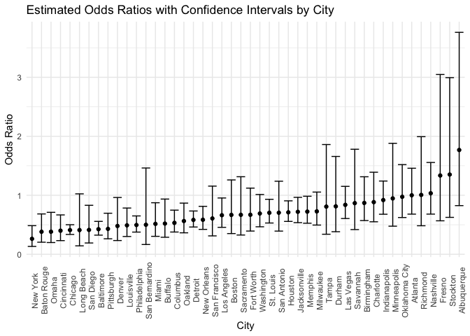

p8105_hw6_yz4990
================
Yucheng Zhao
2024-12-02

## Problem 1.

## Problem 2.

data cleaning

``` r
homi_df = read_csv("./data/homicide-data.csv", 
                   na = c("NA", "Unknown", ""), 
                   ) |> 
  janitor::clean_names() |> 
  mutate(
    city_state = paste(city, state, sep = ", "),
    resolved = as.numeric(disposition == "Closed by arrest")
    ) |> 
  filter(city != "Dallas", 
         city != "Phoenix",
         city != "Kansas City", 
         city != "Tulsa") |> 
  filter(victim_race == "White" | victim_race == "Black") |> 
  drop_na(victim_age) |> 
  mutate(victim_age = as.numeric(victim_age))
```

    ## Rows: 52179 Columns: 12
    ## ── Column specification ────────────────────────────────────────────────────────
    ## Delimiter: ","
    ## chr (8): uid, victim_last, victim_first, victim_race, victim_sex, city, stat...
    ## dbl (4): reported_date, victim_age, lat, lon
    ## 
    ## ℹ Use `spec()` to retrieve the full column specification for this data.
    ## ℹ Specify the column types or set `show_col_types = FALSE` to quiet this message.

``` r
head(homi_df)
```

    ## # A tibble: 6 × 14
    ##   uid   reported_date victim_last victim_first victim_race victim_age victim_sex
    ##   <chr>         <dbl> <chr>       <chr>        <chr>            <dbl> <chr>     
    ## 1 Alb-…      20100601 SATTERFIELD VIVIANA      White               15 Female    
    ## 2 Alb-…      20100102 MULA        VIVIAN       White               72 Female    
    ## 3 Alb-…      20100126 BOOK        GERALDINE    White               91 Female    
    ## 4 Alb-…      20100130 MARTIN-LEY… GUSTAVO      White               56 Male      
    ## 5 Alb-…      20100308 GRAY        STEFANIA     White               43 Female    
    ## 6 Alb-…      20100323 DAVID       LARRY        White               52 Male      
    ## # ℹ 7 more variables: city <chr>, state <chr>, lat <dbl>, lon <dbl>,
    ## #   disposition <chr>, city_state <chr>, resolved <dbl>

logistic regression for binary variable “resolved”

``` r
balti_df = homi_df |> 
  filter(city == "Baltimore")

fit_logistic = 
  balti_df |> 
  glm(resolved ~ victim_age + victim_sex + victim_race, data = _, family = binomial()) 

fit_logistic |> 
  broom::tidy(conf.int = TRUE) |> 
  filter(term == "victim_sexMale") |> 
  mutate(OR = exp(estimate)) |>
  select(term, OR, conf.low, conf.high) |> 
  knitr::kable(digits = 3)
```

| term           |    OR | conf.low | conf.high |
|:---------------|------:|---------:|----------:|
| victim_sexMale | 0.426 |   -1.126 |    -0.584 |

glm for each city

``` r
results_df = homi_df |> 
  group_by(city) |> 
  nest() |> 
  mutate(
    model = purrr::map(data, \(x) glm(resolved ~ victim_age + victim_sex + victim_race, 
                                          data = x, family = binomial())),
    outputs = purrr::map(model, \(x) broom::tidy(x, conf.int = TRUE))
    ) |> 
  unnest(outputs) |> 
  filter(term == "victim_sexMale") |> 
  mutate(
    OR = exp(estimate),
    conf.low = exp(conf.low),
    conf.high = exp(conf.high)
    ) |>
  select(term, OR, conf.low, conf.high)
```

    ## Adding missing grouping variables: `city`

``` r
knitr::kable(results_df, digits = 3)
```

| city           | term           |    OR | conf.low | conf.high |
|:---------------|:---------------|------:|---------:|----------:|
| Albuquerque    | victim_sexMale | 1.767 |    0.825 |     3.762 |
| Atlanta        | victim_sexMale | 1.000 |    0.680 |     1.458 |
| Baltimore      | victim_sexMale | 0.426 |    0.324 |     0.558 |
| Baton Rouge    | victim_sexMale | 0.381 |    0.204 |     0.684 |
| Birmingham     | victim_sexMale | 0.870 |    0.571 |     1.314 |
| Boston         | victim_sexMale | 0.667 |    0.351 |     1.260 |
| Buffalo        | victim_sexMale | 0.521 |    0.288 |     0.936 |
| Charlotte      | victim_sexMale | 0.884 |    0.551 |     1.391 |
| Chicago        | victim_sexMale | 0.410 |    0.336 |     0.501 |
| Cincinnati     | victim_sexMale | 0.400 |    0.231 |     0.667 |
| Columbus       | victim_sexMale | 0.532 |    0.377 |     0.748 |
| Denver         | victim_sexMale | 0.479 |    0.233 |     0.962 |
| Detroit        | victim_sexMale | 0.582 |    0.462 |     0.734 |
| Durham         | victim_sexMale | 0.812 |    0.382 |     1.658 |
| Fort Worth     | victim_sexMale | 0.669 |    0.394 |     1.121 |
| Fresno         | victim_sexMale | 1.335 |    0.567 |     3.048 |
| Houston        | victim_sexMale | 0.711 |    0.557 |     0.906 |
| Indianapolis   | victim_sexMale | 0.919 |    0.678 |     1.241 |
| Jacksonville   | victim_sexMale | 0.720 |    0.536 |     0.965 |
| Las Vegas      | victim_sexMale | 0.837 |    0.606 |     1.151 |
| Long Beach     | victim_sexMale | 0.410 |    0.143 |     1.024 |
| Los Angeles    | victim_sexMale | 0.662 |    0.457 |     0.954 |
| Louisville     | victim_sexMale | 0.491 |    0.301 |     0.784 |
| Memphis        | victim_sexMale | 0.723 |    0.526 |     0.984 |
| Miami          | victim_sexMale | 0.515 |    0.304 |     0.873 |
| Milwaukee      | victim_sexMale | 0.727 |    0.495 |     1.054 |
| Minneapolis    | victim_sexMale | 0.947 |    0.476 |     1.881 |
| Nashville      | victim_sexMale | 1.034 |    0.681 |     1.556 |
| New Orleans    | victim_sexMale | 0.585 |    0.422 |     0.812 |
| New York       | victim_sexMale | 0.262 |    0.133 |     0.485 |
| Oakland        | victim_sexMale | 0.563 |    0.364 |     0.867 |
| Oklahoma City  | victim_sexMale | 0.974 |    0.623 |     1.520 |
| Omaha          | victim_sexMale | 0.382 |    0.199 |     0.711 |
| Philadelphia   | victim_sexMale | 0.496 |    0.376 |     0.650 |
| Pittsburgh     | victim_sexMale | 0.431 |    0.263 |     0.696 |
| Richmond       | victim_sexMale | 1.006 |    0.483 |     1.994 |
| San Antonio    | victim_sexMale | 0.705 |    0.393 |     1.238 |
| Sacramento     | victim_sexMale | 0.669 |    0.326 |     1.314 |
| Savannah       | victim_sexMale | 0.867 |    0.419 |     1.780 |
| San Bernardino | victim_sexMale | 0.500 |    0.166 |     1.462 |
| San Diego      | victim_sexMale | 0.413 |    0.191 |     0.830 |
| San Francisco  | victim_sexMale | 0.608 |    0.312 |     1.155 |
| St. Louis      | victim_sexMale | 0.703 |    0.530 |     0.932 |
| Stockton       | victim_sexMale | 1.352 |    0.626 |     2.994 |
| Tampa          | victim_sexMale | 0.808 |    0.340 |     1.860 |
| Washington     | victim_sexMale | 0.691 |    0.466 |     1.014 |

plot of the estimated ORs and CIs for each city

``` r
ggplot(results_df, aes(x = reorder(city, OR), y = OR)) +
  geom_point() +
  geom_errorbar(aes(ymin = conf.low, ymax = conf.high)) +
  labs(
    title = "Estimated Odds Ratios with Confidence Intervals by City",
    x = "City",
    y = "Odds Ratio"
  ) + 
  theme_minimal() +
  theme(
    axis.text.x = element_text(angle = 90)
  )
```

<!-- -->

## Problem 3.
